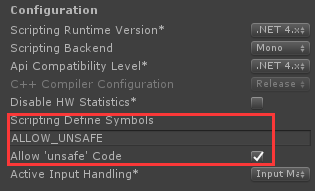

# curl-unity

This is a C# wrapper for Unity to use [libcurl](https://github.com/curl/curl) with [http2](https://github.com/nghttp2/nghttp2)/[openssl](https://github.com/openssl/openssl) enabled.

## Supported platforms

* Windows x64
* macOS 64bit
* iOS arm64/arm64e
* Android armv7/arm64/x86

## Library versions

|Name|Version|
|-|-|
|curl|7.64.0|
|nghttp2|1.36.0|
|openssl|1.1.1b|

# Build

## Requirements

* [CMake](https://cmake.org/download/) is required for all platforms.
* [pkg-config](https://www.freedesktop.org/wiki/Software/pkg-config/) is requried for macOS/iOS/Android. It could be installed via `brew install pkg-config` on macOS.
* [NDK r16b](https://developer.android.com/ndk/downloads/older_releases.html) is required for Android.
* Xcode is required for macOS/iOS.
* Visual Studio 2017 and [Perl](https://www.activestate.com/products/activeperl/downloads/) is required for Windows.

## Scripts

There are several build script under `build` folder for each platform:

> All the scripts will auto deloy the output files into `Assets/curl-unity/Plugins`.

### make_android.sh
    
Build `libcurl.so` for Android. Please use this script on macOS *but it should also works on Linux*.

### make_ios.sh

Build `libcurl.a` for iOS. Please use this script on macOS

### make_osx.sh

Build `curl.bundle` for macOS. Please use this script on macOS.

### make_win.bat

Build `curl.dll` for Windows. Please use this script on Windows.

# Install

Copy `Assets/curl-unity` to anywhere under your Unity project and done.

Besides, for a better performance you could enable `Allow unsafe code` and add `ALLOW_UNSAFE` to the `Scripting Define Symbols` in the project settings.



> This is optional

# Usage

## Select single thread/mutil thread mode

Attach one `CurlMultiRegistry` component to any persistent gameobject, by `DontDestroyOnLoad`, and select `multiThread` on or not.
If the `CurlMultiRegistry` was not pre-created a default instance with `multiThread` on will be auto created.

## Non-blocking multi perform

> Only by using this multi perform that could take the advantage of HTTP/2 multiplexing feature.

```csharp
void Start()
{
    for (int i = 0; i < 5; i++)
    {
        var easy = new CurlEasy();
        easy.url = "https://nghttp2.org";
        easy.useHttp2 = true;
        easy.timeout = 5000;
        // NOTICE: This callback may be invoked on other thread
        easy.performCallback = OnPerformCallback;

        // You could also create your own CurlMulti instance
        easy.MultiPerform(CurlMulti.DefaultMulti);
    }
}

void OnPerformCallback(CURLE result, CurlEasy easy)
{
    if (result == CURLE.OK)
    {
        Debug.Log(easy.inText);
    }
}
```

## Non-blocking easy perform (Deprecated)
```csharp
async void Start()
{
    var easy = new CurlEasy();
    easy.url = "https://nghttp2.org";
    easy.useHttp2 = true;
    easy.timeout = 5000;
    if (await easy.PerformAsync() == CURLE.OK)
    {
        Debug.Log(easy.inText);
    }
}
```

## Blocking easy perform

```csharp
void Start()
{
    var easy = new CurlEasy();
    easy.url = "https://nghttp2.org";
    easy.useHttp2 = true;
    easy.timeout = 5000;
    if (easy.Perform() == CURLE.OK)
    {
        Debug.Log(easy.inText);
    }
}
```